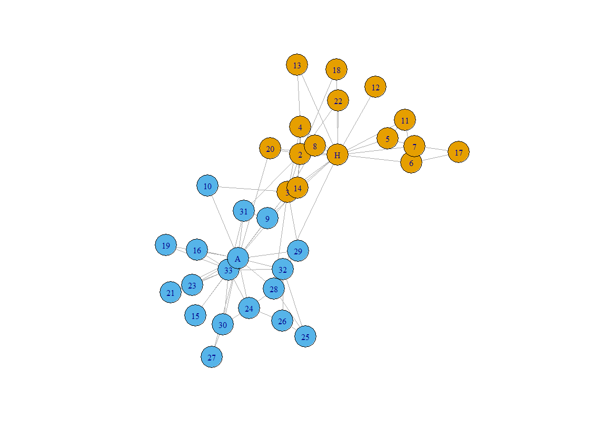

```{r, include=FALSE}
options(tinytex.verbose = TRUE)
```

# Summary

{ig.degree.betweenness} is an R [@base2022] package which implements the "Smith-Pittman" community detection algorithm [@sp_abstract] on networks and sociograms constructed and/or loaded with {igraph} package [@igraph_software] by Csardi and Nepusz [@igraph_article]. Additionally, {ig.degree.betweenness} offers some utility functions to which enable neater plotting of densely connected networks with high number of edges and a low number of nodes and preparation of unlabeled graphs for the Smith-Pittman algorithm's implementation.

# Statement of Need

The {igraph} package offers a suite of community detection algorithms, including Girvan-Newman [@Girvan_Newman_2002], Louvain [@louvain_paper] and others^[For the full list of available community detection algorithms in the {igraph} package, see the {igraph} reference manual: https://igraph.org/c/html/latest/igraph-Community.html]. In densely connected complex networks it has been noted by [@sp_abstract] that considering the number of connections possessed by each individual node in a given network (degree centrality) along with edge-betweeness (as done by [@Girvan_Newman_2002]) offers an approach for identifying clusters which are more descriptive. {ig.degree.betweenness} offers a 

# Minimal Example

## Zachary's Karate Club Network

The dataset commonly referred to as "Zachary's karate club network" by Zachary (1997) is a social network between members of a university club led by president John A. and karate instructor Mr. Hi (pseudonyms). At the beginning of the study there was an initial conflict between the club president, John A., and Mr. Hi over the price of karate lessons. As time passed, the entire club became divided over this issue. After a series of increasingly sharp factional confrontations over the price of lessons, the officers of the club, led by John A., fired Mr. Hi. The supporters of Mr. Hi retaliated by resigning and forming a new organization headed by Mr. Hi. Figure 1 shows the karate club network where the nodes signify individuals in the club and the edges signifies the existence of a relationship between two members. The node color indicates which group the members associated with post-split. 

Since the division of the club and its members is known, this social network is a classic example dataset used and studied. In the context of community detection, the object of interest is seeing if the split could be identified based on the relationships between members. When applied in an unsupervised setting, the Girvan-Newman and Louvain algorthims identify communities of nodes which optimize modularity according to their approaches. However, the communities identified do not appear to identify a possible division in the group which is contextually informative or interpretative. The Smith-Pittman algorithm identifies 3 communities which could can be understood as individuals who would certainly associate with John A. or Mr. Hi and an uncertain group. Figure 2 shows the comparison between the three algorithms. 

```{r karate_network, eval=FALSE}
# Install packages
# install.packages(c("igraph","igraphdata", "ig.degree.betweenness"))

set.seed(5250) #Setting seed to visual reproducibility
library(igraph)
library(igraphdata)
library(ig.degree.betweenness)

data("karate")

par(mar=c(0,0,0,0)+.1)
plot(karate)
```




```{r algorithm_comparison_karate,eval= FALSE}
gn_karate <- karate |>
  igraph::cluster_edge_betweenness()

louvain_karate <- karate |>
  igraph::cluster_louvain()

sp_karate <- karate |>
  ig.degree.betweenness::cluster_degree_betweenness()

par(mfrow= c(1,3),mar=c(0,0,0,0)+1)

plot(
  gn_karate,
  karate,
  main = "(a)"
  )

plot(
  louvain_karate,
  karate,
  main = "(b)"
)

plot(
  sp_karate,
  karate,
  main = "(c)"
)
```


## Other Utility Functions


### Preparing Unlabeled Graphs

```{r simulated_network}

# Set parameters
num_nodes <- 15    # Number of nodes (adjust as needed)
initial_edges <- 1   # Starting edges for preferential attachment

# Create a directed, scale-free network using the Barabási-Albert model
g <- igraph::sample_pa(n = num_nodes, m = initial_edges, directed = TRUE)

# Introduce additional edges to high-degree nodes to accentuate popularity differences
num_extra_edges <- 350   # Additional edges to create more popular nodes
set.seed(123)           # For reproducibility

for (i in 1:num_extra_edges) {
  # Sample nodes with probability proportional to their degree (to reinforce popularity)
  from <- sample( igraph::V(g), 1, prob =  igraph::degree(g, mode = "in") + 1)  # +1 to avoid zero probabilities
  to <- sample( igraph::V(g), 1)

  # Ensure we don't add the same edge repeatedly unless intended, allowing self-loops
  g <-  igraph::add_edges(g, c(from, to))
}

# Add self-loops to a subset of nodes
num_self_loops <- 5
for (i in 1:num_self_loops) {
  node <- sample( igraph::V(g), 1)
  g <-  igraph::add_edges(g, c(node, node))
}

g
```

```{r unnamed_graph}
igraph::vertex.attributes(g)$name
```


```{r}
g_ <- ig.degree.betweenness::prep_unlabeled_graph(g)

igraph::vertex.attributes(g_)$name
```


### Plotting Simplified Edgeplots


```{r}
plot(
  g_,
  edge.arrow.size = 0.2,
  main = "Default Network"
  )
```


```{r}

ig.degree.betweenness::plot_simplified_edgeplot(
  g_,
  edge.arrow.size = 0.2,
  main = "Simplified Network"
  )
```

```{r}
par(mfrow = c(1, 2))

sp_communities <- ig.degree.betweenness::cluster_degree_betweenness(g_)

plot(sp_communities,
     g_,
     edge.arrow.size = 0.2,
     main = "Default Network")

ig.degree.betweenness::plot_simplified_edgeplot(
  g_, 
  communities = sp_communities, 
  main = "Simplified Network")
```

# Acknowledgements


# References
