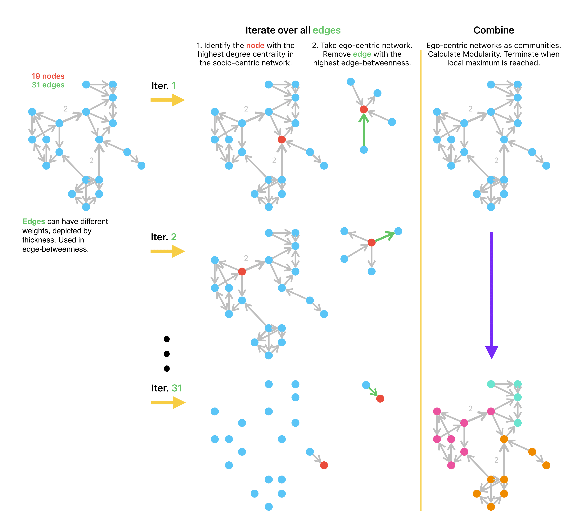

```{r, include=FALSE}
options(tinytex.verbose = TRUE)
```

# Summary

{ig.degree.betweenness} is an R package which allows users to implement the "Smith-Pittman" community detection algorithm on networks and sociograms constructed and/or loaded with the {igraph} package. {ig.degree.betweenness} also offers utility functions which enable neater plotting of densely connected networks with high number of edges and a low number of nodes and the relevant preparation of unlabeled graphs for the Smith-Pittman algorithm's present implementation in the R programming language. There presently do not exist other implementations of this algorithm which are ready to use which are compatible in the {igraph} ecosystem. As a result, this contribution is welcome by {igraph} users interested in exploring and applying the Smith-Pittman algorithm in SNA settings.

# Statement of Need

{igraph} [@igraph_article] offers a suite functions and tools for interacting with graph data and engaging in social network analysis (SNA). A major area of study in SNA is the identification node clusters through methods referred to as "community detection algorithms" [@rostami2023community]. {igraph} allows users to employ a variety of popular community detection algorithms, including Girvan-Newman^[https://r.igraph.org/reference/cluster_edge_betweenness.html] [@Girvan_Newman_2002], Louvain^[https://r.igraph.org/reference/cluster_louvain.html] [@louvain_paper] and others^[For the full list of available community detection algorithms in the {igraph} R package, see the {igraph} reference manual: https://r.igraph.org/reference/index.html#community-detection]. In densely connected complex networks it has been noted by Smith, Pittman and Xu [@sp_paper] that considering the number of connections possessed by each individual node in a given network (degree centrality) along with edge-betweeness (as done by [@Girvan_Newman_2002]) offers an approach for identifying clusters which are more descriptive in certain settings. {ig.degree.betweenness} is an R package that contains a ready-to-use implementation of the Smith-Pittman community detection algorithm. 

# The Smith-Pittman Algorithm

The "Smith-Pittman" algorithm is a variation of the Girvan-Newman algorithm which first considers degree centrality (i.e., the number of connections possessed by each node in a given network) at the beginning of each iteration before examining the network edges' betweenness (i.e., the frequency with which an edge lies on the shortest paths between pairs of nodes, indicating its role in connecting different parts of the network).

The steps for the algorithm are: 

1. Identify the node with the highest degree-centrality in the network. 

2. Select the subgraph of the node with the highest degree centrality. Remove the edge possessing the highest calculated in the subgraph.

3. Recalculate the degree centrality for all nodes in the network and the betweenness for the remaining edge in the network,

4. Repeat from step 2. 

Conceptually, this algorithm (similar to Girvan-Newman and Louvain) can be specified to terminate once a pre-determined number of communities has been identified (based on the remaining connected nodes). However, the intention for using this algorithm is meant to be used in an unsupervised, modularity maximizing setting, where the grouping of nodes is decided on the strength of the connected clusters -a.k.a. modularity^[For a more formal definition of modularity, see: https://en.wikipedia.org/wiki/Modularity_(networks)]. Figure 1 provides a detailed overview of how the algorithm works.




# Minimal Examples

## Zachary's Karate Club Network

The dataset commonly referred to as "Zachary's karate club network" [@zachary1977information] is a social network between members of a university club led by president John A. and karate instructor Mr. Hi (pseudonyms). At the beginning of the study there was an initial conflict between the club president, John A., and Mr. Hi over the price of karate lessons. As time passed, the entire club became divided over this issue. After a series of increasingly sharp factional confrontations over the price of lessons, the officers of the club, led by John A., fired Mr. Hi. The supporters of Mr. Hi retaliated by resigning and forming a new organization headed by Mr. Hi. Figure 2 shows the karate club network where the nodes signify individuals in the club and the edges signifies the existence of a relationship between two members. The node color indicates which group the members associated with post-split. 

Since the division of the club and its members is known, this social network is a classic example dataset used and studied. In the context of community detection, the object of interest is seeing if the split could be identified based on the relationships between members. When applied in an unsupervised setting, the Girvan-Newman and Louvain algorthims identify communities of nodes which optimize modularity according to their approaches. However, the communities identified do not appear to identify a possible division in the group which is contextually informative or interpretative. The Smith-Pittman algorithm identifies 3 communities which could can be understood as individuals who would certainly associate with John A. or Mr. Hi and an uncertain group. Figure 3 shows the comparison between the three algorithms. 

{width=60%}


## TidyTuesday - "Monster Movies" Dataset

<!---
Up to here to write
---->
The first visual is the constructed network. The other visuals are clusters based on the Girvan Newman (Edge Betweenness), Louvain (Direct Modularity Maximization) and Smith(thats me!)-Pittman (Node Degree + Edge Betweenness).

Girvan Newman doesn't tell any story (clustering everything in one group isn't much of a story). Louvain might be telling us something in terms of strength of clustering but doesn't necessarily speak about the reality of "monster" movie genre interactions. Smith-Pittman clustering tells the best story (albeit biased) with popular genres forming the primary working group followed by more ambivalent smaller subgroups and outlier nodes. 

This aligns with the degree (popularity) distribution (the bar graph) of the nodes as well (which is what our working paper asserts as well for certain contexts).

```{r fig.cap='Monster Movie genre network. Node size corresponds to the node degree and edge thickness and numbers corespond the number of connections shared between generes from the dataset.', echo=FALSE, message=FALSE, warning=FALSE}
library(tidyverse)
library(tidygraph)
library(igraph)
library(ig.degree.betweenness)

monster_movie_genres <- readr::read_csv('https://raw.githubusercontent.com/rfordatascience/tidytuesday/master/data/2024/2024-10-29/monster_movie_genres.csv')


dummy_matrix<- monster_movie_genres |>
  dplyr::mutate(
    value=1
  )|>
  tidyr::pivot_wider(
    id_cols = tconst,
    names_from=genres,
    values_from = value,
    values_fill=0
  )|>
  dplyr::select(-tconst)|>
  as.matrix.data.frame()


genre_adj_matrix <-t(dummy_matrix) %*% dummy_matrix
# Setting self referrals to zero
diag(genre_adj_matrix) <- 0


movie_graph<- genre_adj_matrix|>
  as.data.frame()|>
  tibble::rownames_to_column()|>
  tidyr::pivot_longer(cols=Comedy:War)|>
  dplyr::rename(
    c(
      from=rowname,
      to = name
    )
  )|>
  dplyr::rowwise()|>
  dplyr::mutate(
    combo = paste0(sort(c(from, to)), collapse = ",")
  )|>
  dplyr::arrange(combo)|>
  dplyr::distinct(combo,.keep_all = TRUE)|>
  dplyr::select(-combo)|>
  tidyr::uncount(value)|>
  tidygraph::as_tbl_graph()


# Resize nodes based on degree

VS <- igraph::degree(movie_graph)*0.1

par(mar=c(0,0,0,0)+0.1)

ig.degree.betweenness::plot_simplified_edgeplot(
  movie_graph,
  vertex.size=VS,
  edge.arrow.size= 0.001
)

```

```{r echo=FALSE, message=FALSE, warning=FALSE, fig.cap='Girvan-Newman communities. Unable to identify any communities.'}
# Cluster Nodes

gn_cluster <- movie_graph|>
  igraph::as.undirected()|>
  igraph::cluster_edge_betweenness()

louvain_cluster <- movie_graph|>
  igraph::as.undirected()|>
  igraph::cluster_louvain()

sp_cluster <- movie_graph|>
  igraph::as.undirected()|>
  ig.degree.betweenness::cluster_degree_betweenness()


# Visualize
par(mar=c(0,0,0,0)+0.1)

ig.degree.betweenness::plot_simplified_edgeplot(
  movie_graph,
  gn_cluster,
  vertex.size=VS,
  edge.arrow.size=0.001
)

```

```{r echo=FALSE, message=FALSE, warning=FALSE, fig.cap="Louvain communities. Communities identified, but do not provide descriptive value."}
par(mar=c(0,0,0,0)+0.1)

ig.degree.betweenness::plot_simplified_edgeplot(
  movie_graph,
  louvain_cluster,
  main = "Louvain",
  vertex.size=VS,
  edge.arrow.size=0.001
)

```

```{r echo=FALSE, message=FALSE, warning=FALSE, fig.cap="Smith-Pittman communities. Communities identified provide descriptive value based on popular genres followed by a less popular genres, followed by isolated genres with litte to no interaction with other genres in the network."}
par(mar=c(0,0,0,0)+0.1)

ig.degree.betweenness::plot_simplified_edgeplot(
  movie_graph,
  sp_cluster,
  main = "Smith-Pittman",
  vertex.size=VS,
  edge.arrow.size=0.001
)

```

## Other Utility Functions


### Preparing Unlabeled Graphs

```{r simulated_network}

# Set parameters
# Number of nodes (adjust as needed)
num_nodes <- 15   
# Starting edges for preferential attachment
initial_edges <- 1

# Create a directed, scale-free network using the Barabási-Albert model
g <- igraph::sample_pa(n = num_nodes, m = initial_edges, directed = TRUE)

# Introduce additional edges to high-degree nodes to accentuate popularity differences
num_extra_edges <- 350   # Additional edges to create more popular nodes
set.seed(123)           # For reproducibility

for (i in 1:num_extra_edges) {
  # Sample nodes with probability proportional to their degree (to reinforce popularity)
  from <- sample( igraph::V(g), 1, prob =  igraph::degree(g, mode = "in") + 1)  # +1 to avoid zero probabilities
  to <- sample( igraph::V(g), 1)

  # Ensure we don't add the same edge repeatedly unless intended, allowing self-loops
  g <-  igraph::add_edges(g, c(from, to))
}

# Add self-loops to a subset of nodes
num_self_loops <- 5
for (i in 1:num_self_loops) {
  node <- sample( igraph::V(g), 1)
  g <-  igraph::add_edges(g, c(node, node))
}

g
```

```{r unnamed_graph}
igraph::vertex.attributes(g)$name
```


```{r}
g_ <- ig.degree.betweenness::prep_unlabeled_graph(g)

igraph::vertex.attributes(g_)$name
```


### Plotting Simplified Edgeplots


```{r}
 par(mar=c(0,0,0,0)+.1)

plot(
  g_,
  edge.arrow.size = 0.2,
  main = "Default Network"
  )
```


```{r}
 par(mar=c(0,0,0,0)+.1)


ig.degree.betweenness::plot_simplified_edgeplot(
  g_,
  edge.arrow.size = 0.2,
  main = "Simplified Network"
  )
```

```{r}
par(mar=c(0,0,0,0)+.1)

sp_communities <- ig.degree.betweenness::cluster_degree_betweenness(g_)

plot(sp_communities,
     g_,
     edge.arrow.size = 0.2,
     main = "Default Network")

ig.degree.betweenness::plot_simplified_edgeplot(
  g_, 
  communities = sp_communities, 
  main = "Simplified Network")
```


# References
