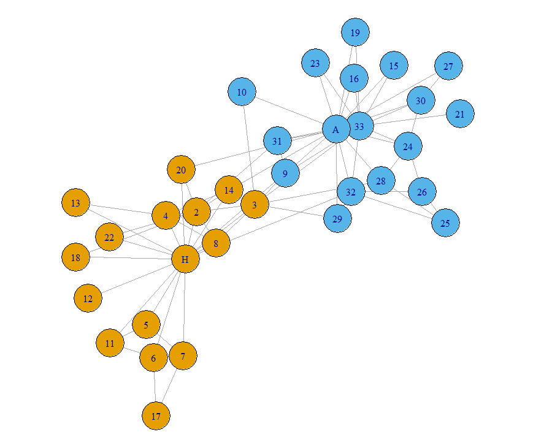
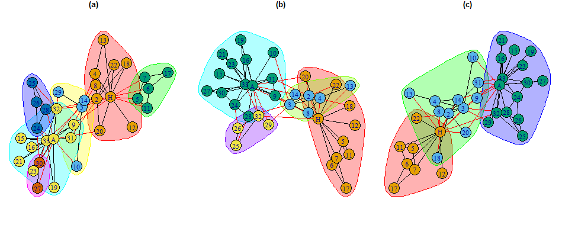

# Summary

{ig.degree.betweenness} is an R (R Core Team 2022) package which
implements the “Smith-Pittman” community detection algorithm (Smith,
Pittman, and Xu 2024) and is directly compatible with networks and
sociograms constructed and loaded with `igraph` package (Csárdi et al.
2024) by Csardi and Nepusz (Csardi and Nepusz 2006).
{ig.degree.betweenness} also offers utility functions to which enable
neater plotting of densely connected networks and preparation of
unlabeled graphs for algorithm implementation.

# Statement of Need

The `igraph` package offers a suite of community detection algorithms,
including Girvan-Newman (Girvan and Newman 2002) and Louvain (Blondel et
al. 2008). In densely connected complex networks it has been noted by
(Smith, Pittman, and Xu 2024) that

# Minimal Example

## Zachary’s Karate Club Network

The dataset commonly referred to as “Zachary’s karate club network” by
Zachary (1997) is a social network between members of a university club
led by president John A. and karate instructor Mr. Hi (pseudonyms). At
the beginning of the study there was an initial conflict between the
club president, John A., and Mr. Hi over the price of karate lessons. As
time passed, the entire club became divided over this issue. After a
series of increasingly sharp factional confrontations over the price of
lessons, the officers of the club, led by John A., fired Mr. Hi. The
supporters of Mr. Hi retaliated by resigning and forming a new
organization headed by Mr. Hi. Figure 1 shows the karate club network
where the nodes signify individuals in the club and the edges signifies
the existence of a relationship between two members. The node color
indicates which group the members associated with post-split.

Since the division of the club and its members is known, this social
network is a classic example dataset used and studied. In the context of
community detection, the object of interest is seeing if the split could
be identified based on the relationships between members. When applied
in an unsupervised setting, the Girvan-Newman and Louvain algorthims
identify communities of nodes which optimize modularity according to
their approaches. However, the communities identified do not appear to
identify a possible division in the group which is contextually
informative or interpretative. The Smith-Pittman algorithm identifies 3
communities which could can be understood as individuals who would
certainly associate with John A. or Mr. Hi and an uncertain group.
Figure 2 shows the comparison between the three algorithms.

    # Install packages
    # install.packages(c("igraph","igraphdata", "ig.degree.betweenness"))

    set.seed(5250) #Setting seed to visual reproducibility
    library(igraph)
    library(igraphdata)
    library(ig.degree.betweenness)

    data("karate")

    par(mar=c(0,0,0,0)+.1)
    plot(karate)

<figure>

<figcaption aria-hidden="true">The Zachary karate club network with the
true split between members defined by node colors. John A. and Mr. Hi
are denoted by ‘J’ and ‘H’, with other members being listed as
numbers</figcaption>
</figure>

    gn_karate <- karate |>
      igraph::cluster_edge_betweenness()

    louvain_karate <- karate |>
      igraph::cluster_louvain()

    sp_karate <- karate |>
      ig.degree.betweenness::cluster_degree_betweenness()

    par(mfrow= c(1,3),mar=c(0,0,0,0)+1)

    plot(
      gn_karate,
      karate,
      main = "(a)"
      )

    plot(
      louvain_karate,
      karate,
      main = "(b)"
    )

    plot(
      sp_karate,
      karate,
      main = "(c)"
    )

<figure>

<figcaption aria-hidden="true">Unsupervised Community Detection by (a)
Girvan-Newman, (b) Louvain and (c) Smith-Pittman for the karate
network.</figcaption>
</figure>

# Acknowledgements

The author expresses gratitude towards Tyler Pittman and Dr. Wei Xu for
their invaluable feedback in developing the methodology in this paper.

# References

Blondel, Vincent D, Jean-Loup Guillaume, Renaud Lambiotte, and Etienne
Lefebvre. 2008. “Fast Unfolding of Communities in Large Networks.”
*Journal of Statistical Mechanics Theory and Experiment* 2008 (10):
P10008. <https://doi.org/10.1088/1742-5468/2008/10/p10008>.

Csardi, Gabor, and Tamas Nepusz. 2006. “The Igraph Software Package for
Complex Network Research.” *InterJournal* Complex Systems: 1695.
<https://igraph.org>.

Csárdi, Gábor, Tamás Nepusz, Vincent Traag, Szabolcs Horvát, Fabio
Zanini, Daniel Noom, and Kirill Müller. 2024.
*igraph: Network Analysis and Visualization
in r*. <https://doi.org/10.5281/zenodo.7682609>.

Girvan, M., and M. E. J. Newman. 2002. “Community Structure in Social
and Biological Networks.” *Proceedings of the National Academy of
Sciences* 99 (12): 7821–26. <https://doi.org/10.1073/pnas.122653799>.

R Core Team. 2022. *R: A Language and Environment for Statistical
Computing*. Vienna, Austria: R Foundation for Statistical Computing.
<https://www.R-project.org/>.

Smith, Benjamin, Tyler Pittman, and Wei Xu. 2024. “Centrality in
Collaboration: Community Detection for Oncology Researchers.”
*University of Toronto Journal of Public Health* TODO.
<https://arxiv.org>.
