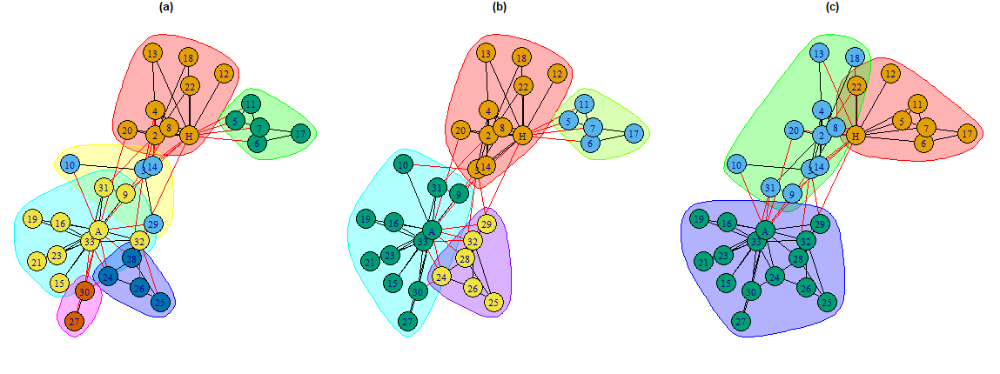
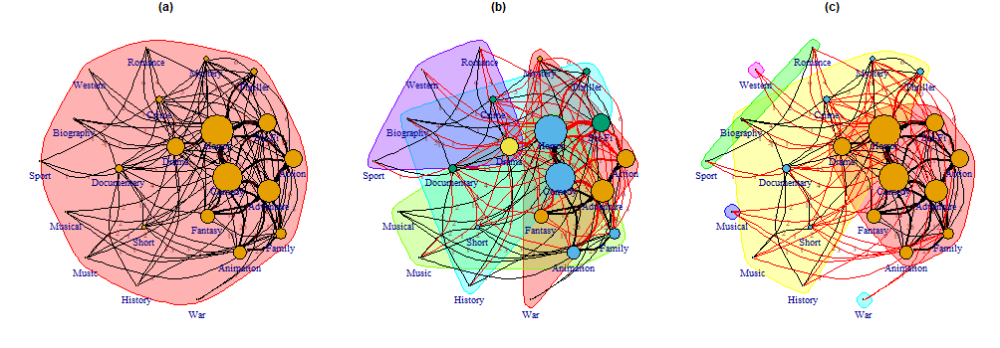

# Summary

{ig.degree.betweenness} is an R package which enables users to implement
the “Smith-Pittman” community detection algorithm on networks and
sociograms constructed or loaded with the {igraph} package.
{ig.degree.betweenness} also provides utility functions to enable neater
plotting of densely connected networks, and to provide relevant
preparation for unlabeled graphs to accommodate its present
implementation of the Smith-Pittman algorithm in the R programming
language. Since this algorithm is relatively new, there are presently
not other implementations of it which are ready to use in the {igraph}
ecosystem. As a result, this contribution is welcome by {igraph} users
interested in exploring and applying the Smith-Pittman algorithm in
social network analysis (SNA) settings.

# Statement of Need

{igraph} (Csardi and Nepusz 2006) offers a suite of functions and tools
for interacting with graph data, and engaging with SNA. A major area of
study and application in SNA is the identification node clusters through
methods broadly referred to as “community detection algorithms.” There
is no specific model which describes exactly what a ”community” is.
Generally, community detection algorithms employ specific optimization
strategies to partition a large-scale complex network into a set of
disjoint and compact subgroups, often (but not always) without prior
knowledge regarding the number of subgroups and their sizes (Rostami et
al. 2023).

{igraph} supports a range of popular community detection algorithms,
including Girvan-Newman^[<https://r.igraph.org/reference/cluster_edge_betweenness.html>] (Girvan and Newman 2002), Louvain^[<https://r.igraph.org/reference/cluster_louvain.html>] (Blondel
et al. 2008) and others^[For the full list of available community detection algorithms in the
{igraph} R package, see the {igraph} reference manual:
<https://r.igraph.org/reference/index.html#community-detection>]. For densely connected, complex networks,
research by Smith, Pittman and Xu (Smith, Pittman, and Xu 2024) that
combines node degree (degree centrality) with edge-betweeness (as
utilized by (Girvan and Newman 2002)) can enhance cluster identification
in certain contexts. The {ig.degree.betweenness} package offers {igraph}
users a ready-to-use implementation of the Smith-Pittman community
detection algorithm in R (R Core Team 2022).

# The Smith-Pittman Algorithm

The “Smith-Pittman” algorithm is a variation of the Girvan-Newman
algorithm, which first considers degree centrality (i.e. the number of
connections possessed by each node in a given network) at the beginning
of each iteration. It then examines network-wide edge betweenness
(i.e. the frequency with which an edge lies on the shortest paths
between pairs of nodes, indicating its role in connecting different
parts of the network).

The steps for the algorithm are:

1.  Identify the node with the highest degree-centrality in the network.

2.  Select the subgraph of the node with the highest degree centrality.
    Remove the edge possessing the highest calculated (network-wide)
    edge betweenness in the subgraph.

3.  Recalculate the degree centrality for all nodes in the network, and
    the betweenness for the remaining edges in the network,

4.  Repeat from step 2.

Conceptually, this algorithm (similar to Girvan-Newman and Louvain) can
be specified to terminate once a pre-determined number of communities
has been identified, based on the remaining connected nodes. However,
the intention for using this algorithm is meant to be used in an
unsupervised, modularity maximizing setting, where the grouping of nodes
is decided on the strength of the connected clusters -a.k.a.
modularity^[For a more formal definition of modularity, see:
<https://en.wikipedia.org/wiki/Modularity_(networks)>]. Figure 1 provides a detailed overview of how the
algorithm works.


# Minimal Examples

## Zachary’s Karate Club Network

The dataset commonly referred to as “Zachary’s karate club network”
(Zachary 1977) is a social network between members of a university club
led by president John A. and karate instructor Mr. Hi (pseudonyms). At
the beginning of the study there was an initial conflict between the
club president, John A., and Mr. Hi over the price of karate lessons. As
time passed, the entire club became divided over this issue. After a
series of increasingly sharp factional confrontations over the price of
lessons, the officers of the club, led by John A., fired Mr. Hi. The
supporters of Mr. Hi retaliated by resigning and forming a new
organization headed by Mr. Hi. Figure 2 shows the karate club network
where the nodes signify individuals in the club, and the edges signifies
the existence of a relationship between two members. The node color
indicates which group the members associated with post-split.

Since the division of the club and its members is known, this social
network is a classic example dataset used and studied. The data is
available in the {igraphdata} package (Csardi 2015). In the context of
community detection, the object of interest is seeing if the split could
be identified based on the relationships between members. When applied
in an unsupervised setting, the Girvan-Newman and Louvain algorthims
identify communities of nodes which optimize modularity according to
their approaches. However, the communities identified do not appear to
identify a possible division in the group which is contextually
informative or interpretative. The Smith-Pittman algorithm identifies 3
communities - which could can be understood as individuals who would
certainly associate with John A. or Mr. Hi and an uncertain group.
Figure 3 shows the comparison between the three algorithms.

The code for reproducing figures 2 and 3 are:

```r
    # Install relevant packages
    # install.packages(c("igraph","igraphdata","ig.degree.betweenness"))
    library(igraph)
    library(igraphdata)
    library(ig.degree.betweenness)
    # Attach the Karate Club dataset
    # Data from {igraphdata}
    data("karate")
    # Define layout- for visual purposes
    layout_plot <- layout_nicely(karate, dim = 2)

    # Plot the initial network (Figure 1)
    plot(karate,layout = layout_plot)
    # Girvan-Newman Clustering (Figure 2 (a))
    # Function from {igraph}
    gn_karate <- igraph::cluster_edge_betweenness(karate)

    # Louvain Clustering (Figure 2 (b))
    # Function from {igraph}
    louvain_karate <- igraph::cluster_louvain(karate)

    # Smith-Pittman Clustering (Figure 2 (c))
    # Function from {ig.degree.betweenness}
    sp_karate <- ig.degree.betweenness::cluster_degree_betweenness(karate)

    # Plot 3 plots next to eachother
    par(mfrow= c(1,3),mar=c(0,0,0,0)+1)
    plot(gn_karate, karate, main = "(a)", layout = layout_plot)

    plot(louvain_karate, karate, main = "(b)", layout = layout_plot)

    plot(sp_karate, karate, main = "(c)", layout = layout_plot)
```
<{width=70%}



## TidyTuesday - “Monster Movies” Dataset

The “Monster Movies” dataset, made available by the TidyTuesday project
(Rfordatascience, n.d.) presents an interesting example for applying SNA
and the Smith-Pitman algorithm to interaction between genres in
“monster” titled movies. Figure 4 shows the plotted simplified network
with node sizes corresponding to node degree (i.e. the number of
connections a given genre shares with other genres), edge thickness and
annotated numbers corresponding to the number of edges shared between
listed genres. Figure 5 shows the genre clusters in the network as
preformed by Girvan-Newman, Louvain and Smith-Pittman.

Application of the Girvan-Newman algorithm does not yield informative
community detection (clustering everything in one group is not much of a
story). Louvain might be telling us something in terms of the strength
of clustering, but does not necessarily speak about the reality of
“monster” movie genre interactions. Smith-Pittman clustering tells the
best story. Popular genres form the primary working group, followed by
more ambivalent smaller subgroups, and outlier nodes.

The R code for showing this follows:

```r
    # Install relevant libraries
    # pkgs <- c("dplyr","tibble","tidyr","tidygraph", 
    #           "igraph","ig.degree.betweenness")
    # install.packages(pkgs)
    # Load data
    tuesdata <- tidytuesdayR::tt_load(2024, week = 44)
    monster_movie_genres <- tuesdata$monster_movie_genres

    # Prepare data for adjacency matrix
    dummy_matrix <- monster_movie_genres |>
      dplyr::mutate(value = 1) |>
      tidyr::pivot_wider(
        id_cols = tconst,
        names_from = genres,
        values_from = value,
        values_fill = 0
      ) |>
      dplyr::select(-tconst) |>
      as.matrix.data.frame()

    # Construct adjacency matrix
    genre_adj_matrix <- t(dummy_matrix) %*% dummy_matrix
    # Setting self loops to zero
    diag(genre_adj_matrix) <- 0

    # Construct the graph
    movie_graph <- genre_adj_matrix |>
      as.data.frame() |>
      tibble::rownames_to_column() |>
      tidyr::pivot_longer(cols = Comedy:War) |>
      dplyr::rename(c(from = rowname, to = name)) |>
      dplyr::rowwise() |>
      dplyr::mutate(combo = paste0(sort(c(from, to)), collapse = ",")) |>
      dplyr::arrange(combo) |>
      dplyr::distinct(combo, .keep_all = TRUE) |>
      dplyr::select(-combo) |>
      tidyr::uncount(value) |>
      tidygraph::as_tbl_graph()

    # Resize nodes based on node degree

    VS <- igraph::degree(movie_graph) * 0.1

    # Figure 4
    ig.degree.betweenness::plot_simplified_edgeplot(
      movie_graph,
      vertex.size = VS,
      edge.arrow.size = 0.001
    )
    # Cluster Nodes
    gn_cluster <- movie_graph |>
      igraph::as.undirected() |>
      igraph::cluster_edge_betweenness()

    louvain_cluster <- movie_graph |>
      igraph::as.undirected() |>
      igraph::cluster_louvain()

    sp_cluster <- movie_graph |>
      igraph::as.undirected() |>
      ig.degree.betweenness::cluster_degree_betweenness()


    # Figure 5
    par(mfrow = c(1, 3), mar = c(0, 0, 0, 0) + 1)

    ig.degree.betweenness::plot_simplified_edgeplot(
      movie_graph,
      gn_cluster,
      main = "(a)",
      vertex.size = VS,
      edge.arrow.size = 0.001
    )

    ig.degree.betweenness::plot_simplified_edgeplot(
      movie_graph,
      louvain_cluster,
      main = "(b)",
      vertex.size = VS,
      edge.arrow.size = 0.001
    )

    ig.degree.betweenness::plot_simplified_edgeplot(
        movie_graph,
        sp_cluster,
        main = "(c)",
        vertex.size = VS,
        edge.arrow.size = 0.001
    )
```




# Licensing and Availability

{ig.degree.betweenness} is licensed under a MIT lisence. It is available
on CRAN, and can be installed using
`install.packages("ig.degree.betweenness")`. All code is open-source and
hosted on GitHub, and bugs can be reported at
<https://github.com/benyamindsmith/ig.degree.betweenness/issues/>.

# References

Blondel, Vincent D, Jean-Loup Guillaume, Renaud Lambiotte, and Etienne
Lefebvre. 2008. “Fast Unfolding of Communities in Large Networks.”
*Journal of Statistical Mechanics Theory and Experiment* 2008 (10):
P10008. <https://doi.org/10.1088/1742-5468/2008/10/p10008>.

Csardi, Gabor. 2015. *Igraphdata: A Collection of Network Data Sets for
the ’Igraph’ Package*. <https://CRAN.R-project.org/package=igraphdata>.

Csardi, Gabor, and Tamas Nepusz. 2006. “The Igraph Software Package for
Complex Network Research.” *InterJournal* Complex Systems: 1695.
<https://igraph.org>.

Girvan, M., and M. E. J. Newman. 2002. “Community Structure in Social
and Biological Networks.” *Proceedings of the National Academy of
Sciences* 99 (12): 7821–26. <https://doi.org/10.1073/pnas.122653799>.

R Core Team. 2022. *R: A Language and Environment for Statistical
Computing*. Vienna, Austria: R Foundation for Statistical Computing.
<https://www.R-project.org/>.

Rfordatascience. n.d. “GitHub - Rfordatascience/Tidytuesday: Official
Repo for the \#Tidytuesday Project.” *GitHub*.
<https://github.com/rfordatascience/tidytuesday>.

Rostami, Mohammad, Mourad Oussalah, Kamran Berahmand, and Vahid Farrahi.
2023. “Community Detection Algorithms in Healthcare Applications: A
Systematic Review.” *IEEE Access* 11: 30247–72.

Smith, Benjamin, Tyler Pittman, and Wei Xu. 2024. “Centrality in
Collaboration: A Novel Algorithm for Social Partitioning Gradients in
Community Detection for Multiple Oncology Clinical Trial Enrollments.”
*arXiv.org*. <https://arxiv.org/abs/2411.01394>.

Zachary, Wayne W. 1977. “An Information Flow Model for Conflict and
Fission in Small Groups.” *Journal of Anthropological Research* 33 (4):
452–73. <https://doi.org/10.1086/jar.33.4.3629752>.

